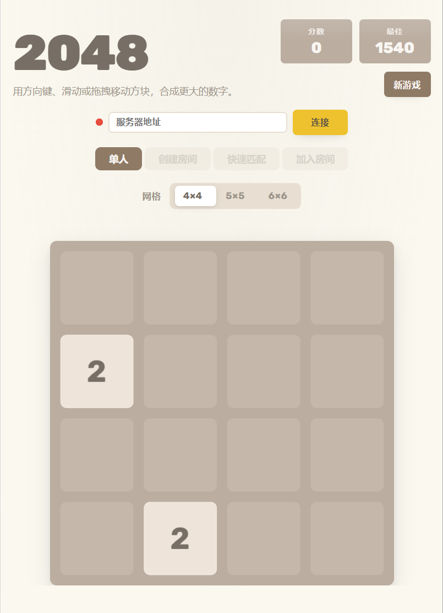
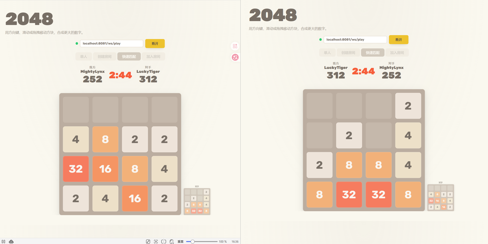
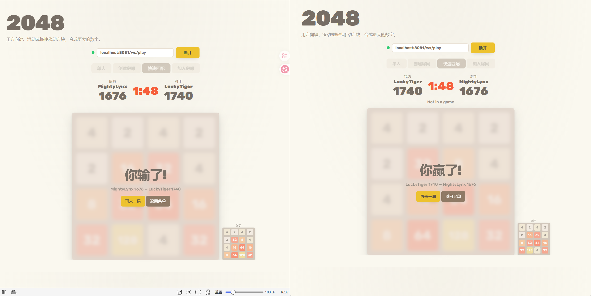

<div align="center">


# 2048

**经典数字游戏 × 实时双人对战**

[](https://github.com/zhongshuyi/2048/stargazers)
[](https://github.com/zhongshuyi/2048/network)
[](./LICENSE)

[](https://www.python.org/)
[](https://fastapi.tiangolo.com/)
[](https://developer.mozilla.org/en-US/docs/Web/API/WebSocket)
[](https://pixijs.com/)
[](https://v2.tauri.app/)
[](https://redis.io/)
[](https://www.docker.com/)

</div>

---

## 目录

- [截图](#截图)
- [功能](#功能)
- [快速开始](#快速开始)
- [Docker 部署](#docker-部署)
- [配置](#配置)
- [技术架构](#技术架构)
- [对战协议](#对战协议)
- [项目结构](#项目结构)
- [桌面构建](#桌面构建)
- [许可证](#许可证)

---

## 功能

<table>
<tr>
<td width="50%">

### 单人模式
- 经典 2048，**4×4 / 5×5 / 6×6** 网格自由切换
- **Ctrl+Z** 撤销，不限次数
- 最高分 localStorage 持久化，刷新不丢失

### 对战模式
- **创建房间** — 自选计时赛 / 竞速赛 + 网格大小，生成 6 位房间码
- **快速匹配** — 按 `模式 + 时限 + 网格` 自动配对
- **加入房间** — 输入 6 位房间码加入对局
- **再来一局** — 双方点击即重开，无需重新创房

</td>
<td width="50%">

### 赛制

| 赛制 | 规则 | 胜利条件 |
|------|------|----------|
| 计时赛 | 1 / 3 / 5 分钟限时 | 时间结束比分高者胜 |
| 竞速赛 | 无时间限制 | 先达 2048 胜，棋盘满判负 |

### 体验
- 对手 **110px 迷你棋盘**实时预览
- 双方分数、倒计时同步显示
- **Tauri v2** 桌面应用，Windows 原生体验

</td>
</tr>
</table>

---

## 截图

<div align="center">

| | | |
|:--:|:--:|:--:|
|  |  |  |
| **首页** | **实时对战** | **结算画面** |

</div>

---

## 快速开始

```bash
# 1. 克隆仓库
git clone https://github.com/zhongshuyi/2048.git && cd 2048

# 2. 安装依赖（需要 Python ≥3.11）
cd backend && pip install -r requirements.txt

# 3. 启动服务（单端口同时提供前端 + WebSocket）
python server.py
```

浏览器打开 http://localhost:8081，打开两个标签页即可测试对战。

---

## Docker 部署

```bash
# 单实例（无 Redis）
docker compose up backend

# 多实例横向扩展（Redis + 2 worker）
docker compose --profile scaled up -d
```

单实例模式直接访问 `http://localhost:8081`；多实例模式由前端 nginx 在 `:8080` 统一入口，后端 worker 运行在 `:8081` 和 `:8082`。

---

## 配置

`backend/config.toml` 提供默认值，环境变量同名覆盖。生产环境使用 `backend/config.prod.toml`：

```toml
[server]
host = "0.0.0.0"
port = 8081
static_dir = "../frontend"      # 前端静态文件路径
max_games = 0                   # 最大并发游戏数（0 = 不限）
cleanup_interval = 300          # 已结束游戏清理间隔（秒）

[redis]
enabled = false                 # true = 启用 Redis 多 worker
url = "redis://localhost:6379"

[logging]
level = "info"
```

```bash
# 环境变量覆盖
PORT=9000 MAX_GAMES=100 REDIS_ENABLED=true python server.py

# 生产环境
CONFIG_PATH=config.prod.toml python server.py
```

---

## 技术架构

```
 ┌─ 浏览器客户端 ─────────────────────────────────────────────┐
 │  ┌──────────┐  ┌──────────┐  ┌───────────┐  ┌──────────┐  │
 │  │  Input   │  │   App    │  │  Engine   │  │ Renderer │  │
 │  │ 键盘/触摸 │─▶│  控制器   │─▶│  纯逻辑    │─▶│  PixiJS  │  │
 │  │ 归一化    │  │  状态锁   │  │  不可变    │  │  Canvas  │  │
 │  └──────────┘  └──────────┘  └───────────┘  └──────────┘  │
 │                                    │                       │
 │                            BattleClient                    │
 │                            (WebSocket)                     │
 └────────────────────────────────┼──────────────────────────┘
                                  │
                       ws://host:8081/ws/play
                                  │
 ┌─ 服务端 (FastAPI) ─────────────┼──────────────────────────┐
 │  ┌──────────────┐  ┌───────────────┐  ┌────────────────┐  │
 │  │  REST API    │  │  RoomManager  │  │    Engine      │  │
 │  │  /api/rooms  │  │  房间/匹配    │  │  校验 & 创建   │  │
 │  └──────────────┘  └───────────────┘  └────────────────┘  │
 │                          │                                  │
 │          ┌───────────────┴────────────────┐                 │
 │          │  In-Memory (默认)  │  Redis    │                 │
 │          │  单 worker          │  多 worker │                │
 │          └─────────────────────┴───────────┘                 │
 └─────────────────────────────────────────────────────────────┘
```

| 层级 | 技术栈 |
|------|--------|
| 渲染引擎 | PixiJS v7.4.2 Canvas2D legacy，自定义 128 采样 cubic-bezier tween |
| 前端逻辑 | 原生 JavaScript (IIFE)，零依赖（除 PixiJS） |
| 后端 | FastAPI + WebSocket + REST，单端口一体化服务 |
| 配置 | TOML + 环境变量覆盖，`config.toml` / `config.prod.toml` |
| 扩展 | Redis Pub/Sub + Hash，支持多 worker 横向扩展 |
| 桌面 | Tauri v2 (Rust + WebView2)，javascript-obfuscator 代码混淆 |
| 部署 | Docker Compose，nginx 前端 + FastAPI 后端 + Redis 可选 |

### 动画系统

基于 PixiJS ticker 的 Promise-based tween 引擎。**128 采样点 cubic-bezier 查找表**精确复现 CSS `ease-out` / `ease` 曲线：

| 阶段 | 时长 | 缓动 | 效果 |
|------|------|------|------|
| 滑动 | 80ms | ease-out | 方块移动到目标位置 |
| 合并弹跳 | 120ms | ease | 容器 scale 1→1.15→1 + 文字 scale 0→1 |
| 新方块出现 | 120ms | ease | 渐入缩放 |

通过 CSS 变量 `--move-ms` / `--pop-ms` / `--appear-ms` 可覆盖动画时长。

### 状态管理

`Engine2048.move()` 深拷贝状态后计算，返回 `{state, moved, scoreGained, reached2048, gameOver, events}`。`events` 为增量事件描述（`moves`、`merges`、`spawns`、`removes`），渲染层据此驱动动画。

### 输入锁

动画播放期间 `app.locked = true`，新按键存入单深度队列 `pendingDirection`。动画结束回调释放锁并消费队列中的下一次输入，保证快节奏操作不丢帧。

---

## 对战协议

客户端权威模型 — 服务端信任客户端计算结果，仅负责房间管理、匹配和状态转发。

| 客户端 → 服务端 | 用途 | 服务端 → 客户端 | 用途 |
|-----------------|------|-----------------|------|
| `create_room` | 创建房间，获取 6 位房间码 | `waiting` | 排队中 / 房间已创建 |
| `join_room` | 凭房间码加入房间 | `start` | 游戏开始（棋盘 + 对手昵称） |
| `join_match` | 进入快速匹配队列 | `opponent_move` | 对手移动（数值网格 + 分数） |
| `move` | 发送本地棋盘状态（80ms 节流） | `opponent_dead` | 对手棋盘无合法移动 |
| `rematch` | 请求再来一局（双方同意即重开） | `game_over` | 游戏结束（胜负 + 原因 + 比分） |
| `cancel` | 离开队列 / 房间 | `error` | 服务端错误信息 |

**匹配键**: `"{mode}:{time}:{gridSize}"` — 仅配置完全相同的玩家才会匹配。

**游戏模式**: `timed`（计时赛，1/3/5 分钟）| `race`（竞速赛，先到 2048 胜）

---

## 项目结构

```
2048/
├── frontend/                       # 前端 — 纯静态文件
│   ├── index.html                  # 入口页面，Rubik 字体
│   ├── assets/main.css             # 全局样式、CSS 变量、响应式
│   ├── js/
│   │   ├── game-engine.js          # 纯逻辑引擎，不可变状态
│   │   ├── ui-renderer.js          # PixiJS 渲染 + 动画系统
│   │   ├── app.js                  # 主控：模式切换、状态锁、撤销
│   │   ├── input.js                # 键盘 / 触摸滑动 / 鼠标拖拽
│   │   ├── storage.js              # localStorage 持久化
│   │   └── battle-client.js        # WebSocket 对战客户端
│   └── vendor/pixi.min.js          # PixiJS v7.4.2 legacy (Canvas2D)
│
├── backend/                        # 后端 — Python FastAPI
│   ├── server.py                   # WebSocket + REST + SPA 静态服务
│   ├── config.py                   # TOML + env 配置加载器
│   ├── config.toml                 # 默认配置
│   ├── config.prod.toml            # 生产环境配置（高并发 + Redis）
│   ├── requirements.txt
│   ├── Dockerfile
│   └── game/
│       ├── engine.py               # Python 版引擎（与 JS 引擎逻辑一致）
│       ├── room_manager.py         # 内存版房间/匹配管理
│       └── room_manager_redis.py   # Redis 版（Pub/Sub 横向扩展）
│
├── desktop/                        # 桌面端 — Tauri v2
│   ├── package.json
│   ├── scripts/
│   │   ├── build-dist.mjs          # 前端资源复制 + JS 混淆
│   │   └── gen-icons.mjs           # favicon → PNG/ICO 多尺寸图标
│   └── src-tauri/                  # Rust 源码 + 图标资源
│
├── docker-compose.yml              # Docker 部署编排
└── LICENSE                         # MIT
```

---

## 桌面构建

```bash
cd desktop
npm install
npm run build:dist        # 前端资源 → desktop/dist + 代码混淆
npx tauri build           # 打包 → NSIS installer (.exe)
```

输出目录：`desktop/src-tauri/target/release/bundle/nsis/`

---

## 许可证

[MIT © zhongshuyi](./LICENSE)
